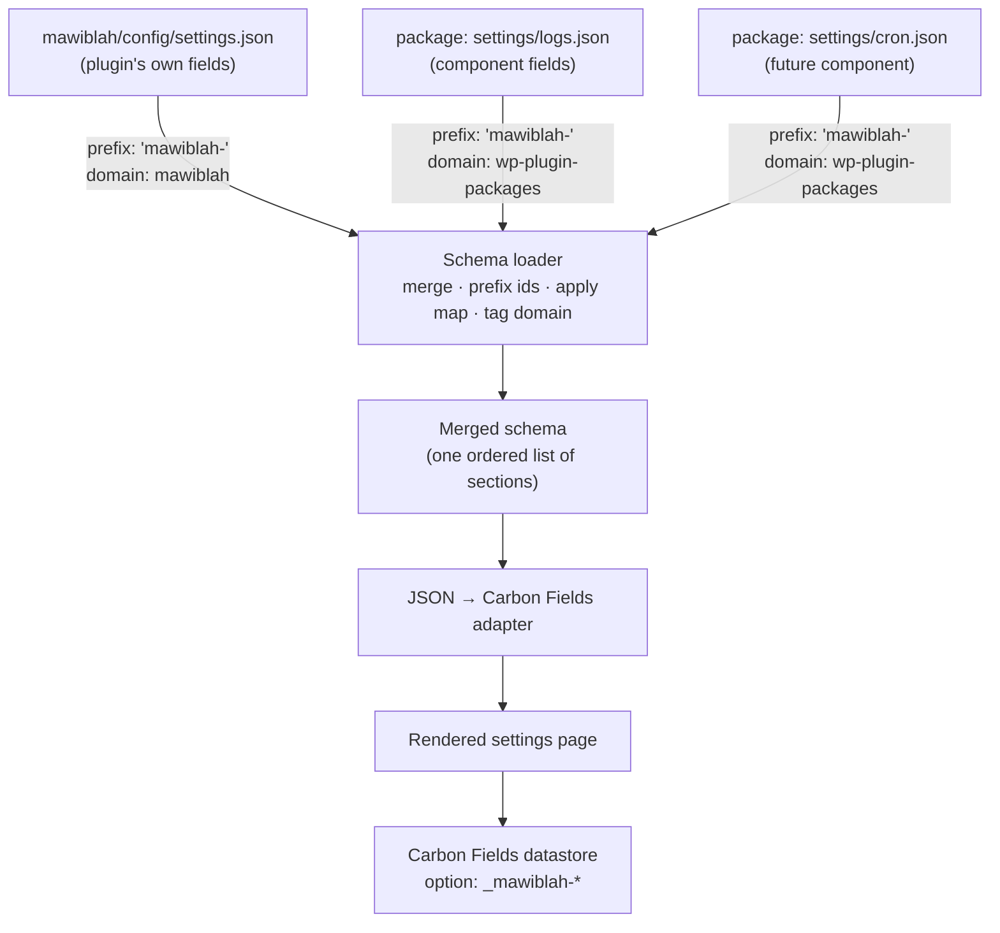
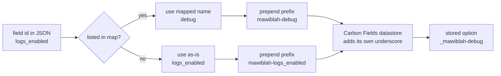
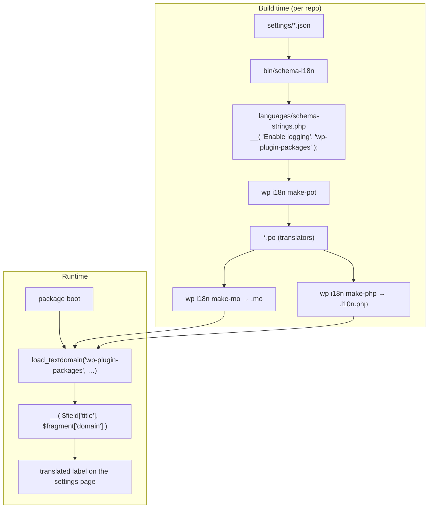
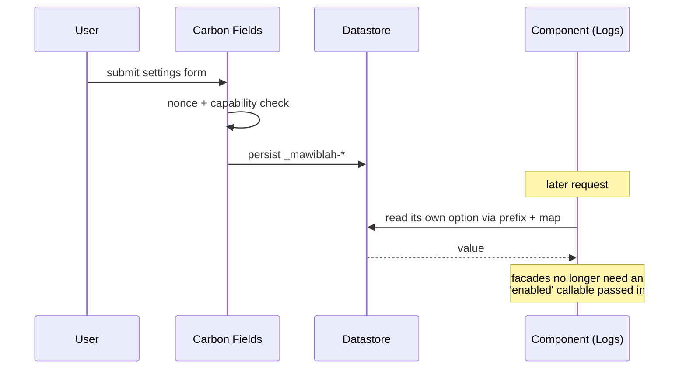
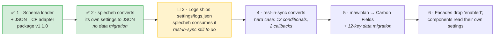

# Plan — JSON settings schema

Status: **phases 1–3 done** (package v1.2.0, splecheh converted). Phases 4–6
remain. Living document; update as decisions land.

## Goal

Every settings field — a plugin's own and a shared component's — is declared as
JSON. A plugin's settings page registers one or more schema files, the loader
merges them into a single schema, and one renderer draws the page.

The immediate payoff is that a component can ship its own settings. The logging
"enabled" toggle currently exists three times, in three shapes:

| plugin | option key | control | stored via |
| --- | --- | --- | --- |
| mawiblah | `mawiblah-debug` | select (`disabled` / `enable-file-log`) | plain `get_option()` |
| splecheh | `splecheh_logs_enabled` | checkbox | Carbon Fields (`_splecheh_logs_enabled`) |
| rest-in-sync | `rest_in_sync_enable_logging` | checkbox | Carbon Fields |

With a component-owned schema there is one definition, and gawg/yolsa get a
correct logging UI the moment they adopt logging.

## Decisions

| # | Decision | Rationale |
| --- | --- | --- |
| 1 | **Converge on Carbon Fields as the renderer.** mawiblah moves off its hand-rolled templates. | One setup everywhere; CF already handles conditional logic and dynamic options, which are used 25 times across the plugins. |
| 2 | **Components ship JSON; the package holds one JSON→CF adapter.** (Option A.) | The adapter is written once. A logging component should not depend on a third-party UI library, and JSON survives if Carbon Fields ever stops being the answer. |
| 3 | **All settings become JSON**, not just component ones. | A single format and a single renderer; the plugin's own fields and a component's fields compose the same way. |
| 4 | **Ids are prefixed at load time; `map` overrides where a legacy key must survive.** | Each plugin needs its own option keys. `map` makes adoption non-destructive for plugins with established keys. |
| 5 | **Text domain travels with the schema fragment.** | A string's domain is decided by which file it came from, so package strings resolve against the package's domain and plugin strings against the plugin's. |

## How the settings page composes



Each plugin registers what it wants; nothing is global:

```php
Settings::register( MAWIBLAH_CONFIG_PATH . '/settings.json', [
    'prefix' => 'mawiblah-',
    'domain' => 'mawiblah',
] );

Settings::register( WpPackages_Registry::schema( 'logs' ), [
    'prefix' => 'mawiblah-',
    'domain' => 'wp-plugin-packages',
    'map'    => [ 'logs_enabled' => 'debug' ],   // keep the legacy key
] );
```

## Id resolution

A component's JSON declares bare ids. The loader rewrites them so two plugins on
one site never share an option.



Two rules that fall out of this:

- **Section ids are prefixed too.** mawiblah already has a section called
  `debug`; a component could collide. Section ids become HTML `id` attributes
  and anchors, so a collision is a visible bug.
- **The prefix is a literal string, not derived from the slug.** mawiblah uses
  hyphens, splecheh underscores. Passing `'mawiblah-'` or `'splecheh_'` lets
  both conventions stand with nothing renamed.

## What the format must cover

Taken from what the five plugins actually use today, not from guesswork.

**Field types** — `text` (29), `checkbox` (10), `select` (6), `html` (5),
`textarea` (4), `separator` (3), `set` (2), `complex` (2).

**Structure** — `set_help_text` (38), `set_conditional_logic` (17),
`set_attribute` (15), `add_tab` (9), `set_options` (8), `add_fields` (4).

Three of these need care:

1. **Conditional logic is pure data** and maps over directly:
   ```json
   {
       "conditional_logic": [
           { "field": "is_remote_server", "value": "yes", "compare": "=" }
       ]
   }
   ```
   Note the `field` reference must be prefixed by the loader too, or the
   condition will point at an id that no longer exists.

2. **Dynamic option lists cannot be literal JSON.** Two cases in rest-in-sync —
   `get_available_post_types()` and `Rest_In_Sync_Cron::get_interval_options()`
   — plus three in splecheh. Needs an escape hatch resolved at render time:
   ```json
   {
       "id": "cron_interval",
       "type": "select",
       "options": "@callback:rest_in_sync_interval_options"
   }
   ```
   Callbacks are registered by name, never eval'd from the JSON.

3. **`complex` fields nest, recursively.** yolsa has a repeater inside a
   repeater (`keyword_list` → `kyeword_variations`). The format needs recursive
   `fields`, and the loader needs to prefix ids at every depth.
   *(That inner field name is misspelled in yolsa today — fix it during
   conversion rather than fossilising it in the schema.)*

4. **Default values can be dynamic too**, which the worked example below
   surfaced. splecheh derives one default from the site locale
   (`explode( '_', get_locale() )[0]`) and another from a plugin constant
   (`'php ' . SPLECHEH_DIR . 'tools/llm-wrapper.php'`). Neither can be a JSON
   literal, so `default_value` needs the same `@callback:` escape hatch as
   `options`.

`html` fields carry markup in a translated string; they need the same
`wp_kses_post` treatment on output that the notices component already uses.
Where the markup is generated rather than literal, `"html": "@callback:name"`
passes the *callable* to Carbon Fields so it renders at display time — splecheh's
interpunction test field embeds a nonce and depends on this.

Two more requirements emerged while converting splecheh for real:

5. **`defaults` per fragment.** A component ships one default, but a plugin may
   need a different one. splecheh's logging has always defaulted to on, so
   adopting the shared field had to preserve that rather than quietly turning it
   off for new installs. `register()` takes `defaults` for this.

6. **`help_text_args`.** splecheh builds one help string with `sprintf()` from
   the detected locale. Keeping the sentence a literal in the schema and passing
   the value as an argument means the string stays translatable — a
   `@callback:` on the whole help text would not be.

## Worked example — splecheh after conversion

splecheh is the first plugin to convert, so this is what its settings would look
like. It is a good stress test: three tabs, dynamic options, dynamic defaults,
conditional logic, and a field that moves out to a component.

### `splecheh/config/settings.json` (excerpt)

Help text is truncated here with `…`; in the real file it is the full string.

```json
{
  "tabs": [
    {
      "id": "general",
      "title": "General",
      "fields": [
        {
          "id": "post_types",
          "type": "set",
          "title": "Post Types to Spellcheck",
          "options": "@callback:splecheh_public_post_type_options",
          "help_text": "Select which post types should be checked…"
        },
        {
          "id": "language",
          "type": "text",
          "title": "Spell Check Language",
          "default_value": "@callback:splecheh_default_language",
          "help_text": "Language code used for spell checking…"
        },
        {
          "id": "ignore_shortcodes",
          "type": "checkbox",
          "title": "Ignore Shortcodes",
          "help_text": "When enabled, shortcode literals are excluded…"
        },
        {
          "id": "whitespace_check",
          "type": "select",
          "title": "Double Spaces",
          "default_value": "report",
          "options": {
            "report": "Report as issues",
            "fix": "Fix automatically",
            "ignore": "Don't check"
          },
          "help_text": "What to do about runs of two or more spaces…"
        }
      ]
    },
    {
      "id": "interpunction",
      "title": "Interpunction",
      "fields": [
        {
          "id": "interpunction_type",
          "type": "select",
          "title": "Type",
          "default_value": "commandline",
          "options": {
            "commandline": "Commandline - Local model",
            "api": "Hosted API"
          },
          "help_text": "How the interpunction check request is made."
        },
        {
          "id": "interpunction_command",
          "type": "text",
          "title": "Commandline Command",
          "default_value": "@callback:splecheh_default_llm_command",
          "conditional_logic": [
            { "field": "interpunction_type", "value": "commandline", "compare": "=" }
          ],
          "help_text": "Shell command to run for the Commandline type…"
        },
        {
          "id": "interpunction_access_key",
          "type": "text",
          "title": "Access Key",
          "conditional_logic": [
            { "field": "interpunction_type", "value": "commandline", "compare": "!=" }
          ],
          "help_text": "API token used to authenticate with the provider…"
        }
      ]
    }
  ]
}
```

Note that `conditional_logic.field` uses the **bare** id (`interpunction_type`).
The loader prefixes it alongside the field ids, so the reference stays valid
after rewriting — if it were written pre-prefixed it would break the moment the
prefix changed.

### `settings/logs.json` (shipped by the package)

```json
{
  "sections": [
    {
      "id": "logging",
      "title": "Logging",
      "description": "Daily log files, written to the uploads directory.",
      "fields": [
        {
          "id": "logs_enabled",
          "type": "checkbox",
          "title": "Enable logging",
          "help_text": "Record plugin actions to daily log files."
        }
      ]
    }
  ]
}
```

This replaces `splecheh_logs_enabled`, which is declared by hand in
`splecheh.php` today.

### Registration

```php
add_action( 'carbon_fields_register_fields', function () {
    Settings::register( SPLECHEH_DIR . 'config/settings.json', [
        'prefix' => 'splecheh_',
        'domain' => 'splecheh',
    ] );

    Settings::register( WpPackages_Registry::schema( 'logs' ), [
        'prefix' => 'splecheh_',
        'domain' => 'wp-plugin-packages',
    ] );

    Settings::callback( 'splecheh_public_post_type_options', function () {
        $options = [];
        foreach ( get_post_types( [ 'public' => true ], 'objects' ) as $type ) {
            $options[ $type->name ] = $type->label;
        }
        return $options;
    } );

    Settings::callback( 'splecheh_default_language', fn() => explode( '_', get_locale() )[0] );
    Settings::callback( 'splecheh_default_llm_command', fn() => 'php ' . SPLECHEH_DIR . 'tools/llm-wrapper.php' );

    Settings::render();
} );
```

Callbacks are registered by name and resolved at render time. Nothing in the
JSON is ever eval'd.

### What comes out

| JSON id | source | option key after prefixing | stored by CF as |
| --- | --- | --- | --- |
| `post_types` | plugin | `splecheh_post_types` | `_splecheh_post_types` |
| `language` | plugin | `splecheh_language` | `_splecheh_language` |
| `interpunction_type` | plugin | `splecheh_interpunction_type` | `_splecheh_interpunction_type` |
| `logs_enabled` | **package** | `splecheh_logs_enabled` | `_splecheh_logs_enabled` |

The logging key lands on exactly the name splecheh already uses, so for this
plugin adopting the component needs **no `map` and no data migration** — which
is precisely why it goes first.

## Translations

Two halves, both required. They are not alternatives.

**Registering strings at runtime does not work.** Calling something as the page
renders only *collects* strings — it does not produce translations. That is
exactly what mawiblah's `get_translation()` did, and it was removed in
`refactor: retire get_translation()` because it fed nothing. Do not rebuild it.

### Build time — producing the `.pot`

`wp i18n make-pot` scans PHP source, so it cannot see strings that live in JSON.
The fix is that a schema is *static at release time*, so a generator can emit a
PHP manifest of `__()` calls for the scanner to find.

### Runtime — loading the translations

The package loads its own text domain, so component strings translate once for
every consuming plugin rather than being re-translated per plugin.



Notes:

- The manifest is generated, never hand-edited, and regenerated whenever a JSON
  changes. A CI check that regenerating produces no diff keeps it honest.
- Ship both `.l10n.php` and `.mo`. WordPress 6.5+ prefers the PHP file (it
  benefits from the opcode cache); `.mo` remains the fallback. mawiblah is
  `Requires at least: 5.0`, so both are warranted.
- The package must load its text domain from the **winning copy** — the same
  arbitration the version gate already performs — or a newer schema could pair
  with older translations.
- The same generator serves the plugins for their own JSON with their own
  domains. This matters: splecheh and rest-in-sync have `__( 'Enable Logs',
  'splecheh' )` in PHP today, which *is* statically scannable. Moving those
  fields to JSON removes that, so they must adopt the generator in the same
  step or they lose translatability they currently have.

## Save path



Carbon Fields owns nonce, capability and sanitisation on save, which removes
mawiblah's current `get_sections()` — a getter that writes on POST, and already
the source of one bug (`fix: scope get_sections() nonce check to mawiblah's own
settings page`).

## Migration risk

Only one step touches live data, and it is mawiblah.

Carbon Fields stores theme options under an underscore-prefixed key, so
`mawiblah-debug` becomes `_mawiblah-debug`. Existing installs hold values under
the *un*-prefixed names. Without a migration all 12 settings silently revert to
defaults — logging off, reCAPTCHA off, thresholds reset.

Mitigations:

- `Migrations.php` already runs version-gated migrations off `mawiblah_db_version`.
  This is a `migrateTo10xx()` copying the 12 keys.
- The read surface is small: nearly every read goes through
  `Settings::getOption()`, wrapped in typed accessors. `Logs::enabled()` is the
  one outlier, reading `get_option('mawiblah-debug')` directly.
- mawiblah's `mawiblah-debug` is a *select* storing `disabled` /
  `enable-file-log`, while the shared field is a checkbox storing `1` / `''`.
  The value shape changes, not just the key.
- mawiblah's settings page has a custom collapsible-section UI. Carbon Fields
  renders its own way, so the page will look different. Functional change, not a
  regression, but visible.

## Phase order



splecheh goes first because it is already Carbon Fields — it exercises the
adapter with no data migration at all. mawiblah goes last because it is the only
step touching live data, by which point the adapter is proven on two plugins.
gawg and yolsa follow whenever convenient; yolsa's nested repeater is the
format's stress test.

## Open questions

- Does the loader merge sections by id (letting a plugin extend a component's
  section) or keep fragments as discrete blocks? Discrete is simpler and is the
  assumption above.
- Ordering between fragments — declaration order, or an explicit `priority` per
  fragment?
- Should the component's settings render inside the plugin's existing settings
  page, or as a separate tab? `add_tab` is used 9 times already, so a tab per
  component is plausible.
- Do gawg and yolsa adopt the logging component at the same time, or is that a
  separate decision once the settings work lands?


---

# Candidate — shared LLM integration

Investigated, not started. Recorded so the findings are not lost.

Three consumers, in very different states:

| plugin | today |
| --- | --- |
| **splecheh** | Working multi-provider backend: `InterpunctionBackend` (623 lines) dispatches to openai / claude / gemini / commandline, plus `tools/llm-wrapper.php` (413 lines) for local models via ollama. Handles chunking, timeouts, JSON-array response parsing and error description. |
| **yolsa** | Separate, OpenAI-only, and reportedly not working: `ChatGptApi` (261 lines) uses the Assistants API — assistant/thread/message endpoints — with its own curl and its own settings keys. Shares no code with splecheh. |
| **poly-9000** | Empty scaffold. "LLM translation plugin for WordPress" — one commit, LICENSE and README only. |

poly-9000 being empty is the argument for doing this sooner rather than later:
it can be built on the component instead of growing a third implementation to
reconcile afterwards.

**What looks genuinely shared** — provider selection and credentials, endpoint
overrides, model choice, timeouts, chunking, the request/retry mechanics, JSON
response extraction and the error taxonomy. splecheh already has all of it in a
provider-agnostic shape.

**What stays per-plugin** — the prompt, the response schema each plugin expects,
and what it does with the result. splecheh wants
`{original, fixed, explanation}` per sentence; poly-9000 will want translations;
yolsa wants a meta description.

**Settings overlap directly with the work above**: provider, access key,
endpoint, model and timeout are exactly the fields splecheh now declares in
`config/settings.json`. An `llm` component would ship its own `settings/llm.json`
the same way `logs.json` does, which is the pattern this plan already
establishes.

**Open question** — yolsa uses the OpenAI Assistants API (stateful assistants and
threads) while splecheh uses plain chat completions. Those are different enough
that the component would need to either pick one or model both. Worth
establishing why yolsa is broken first: if the Assistants approach is the reason,
converging on completions may fix it as a side effect.
